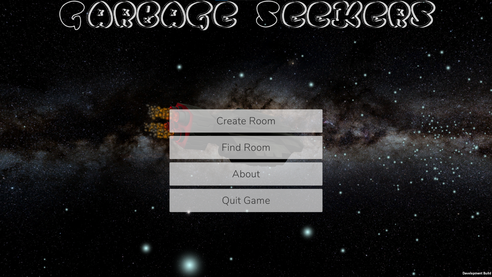
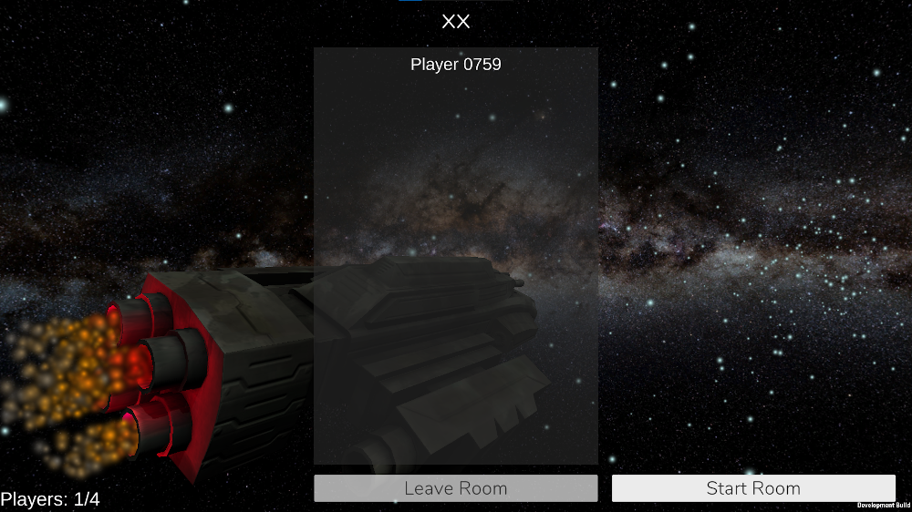
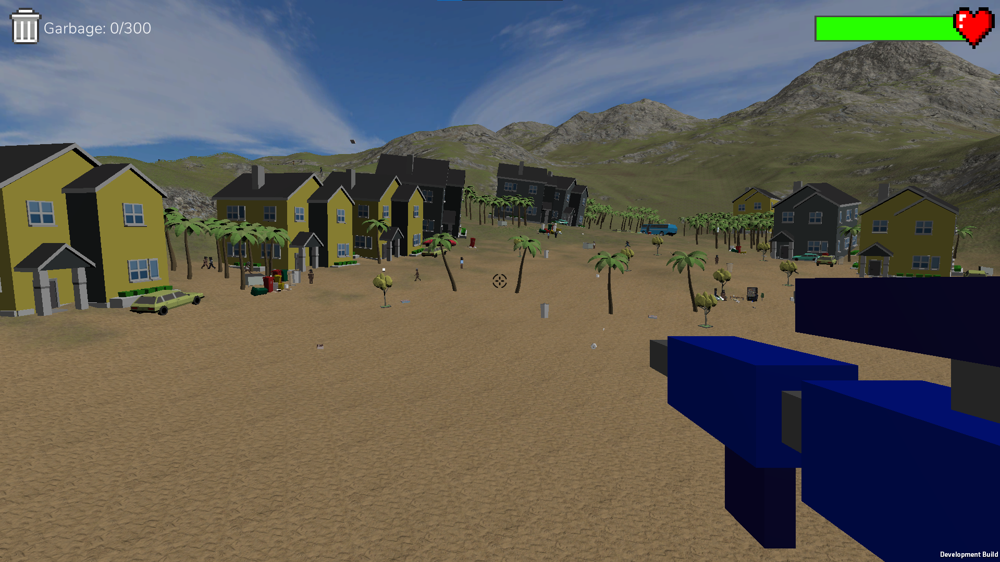
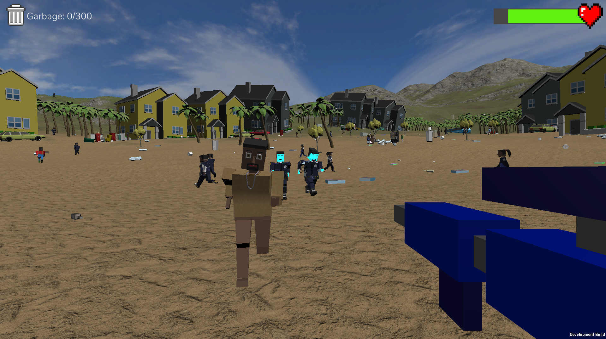
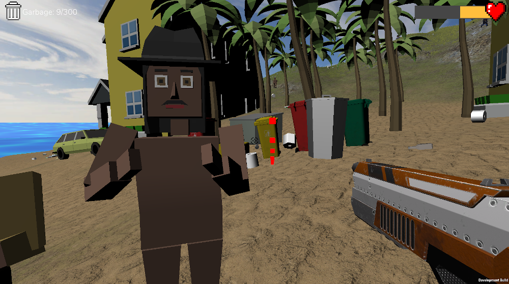
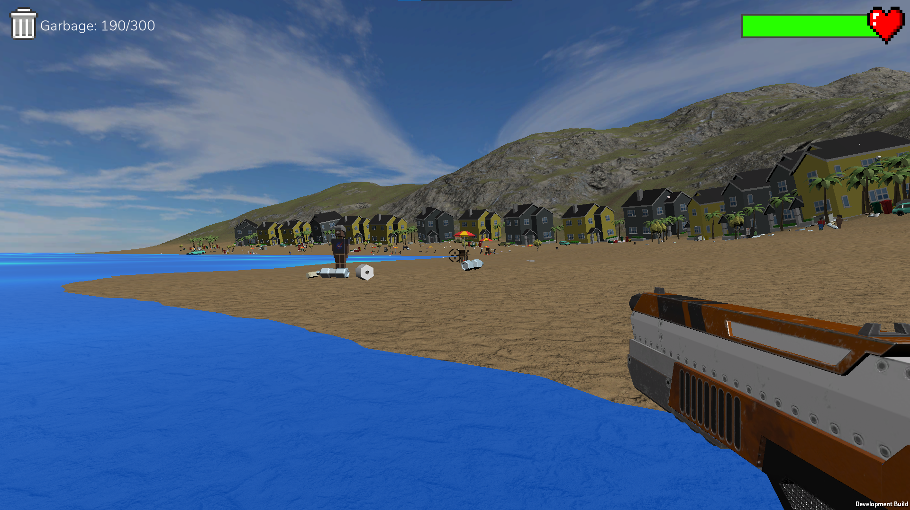
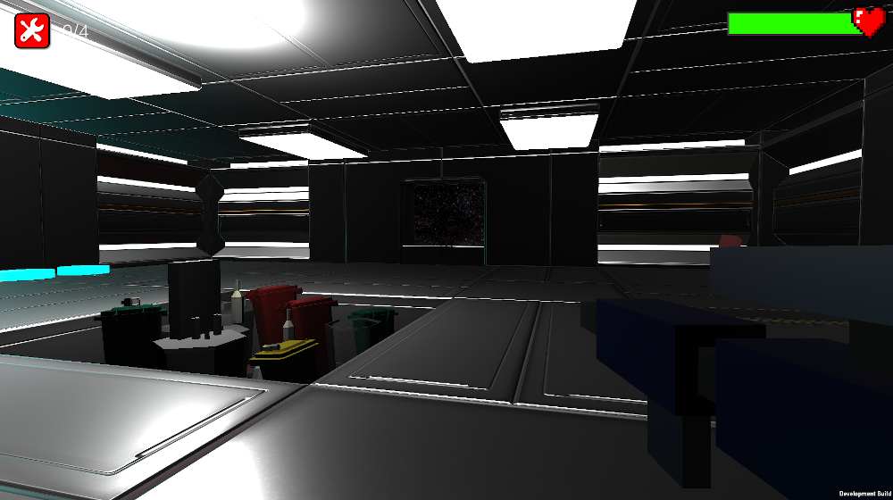
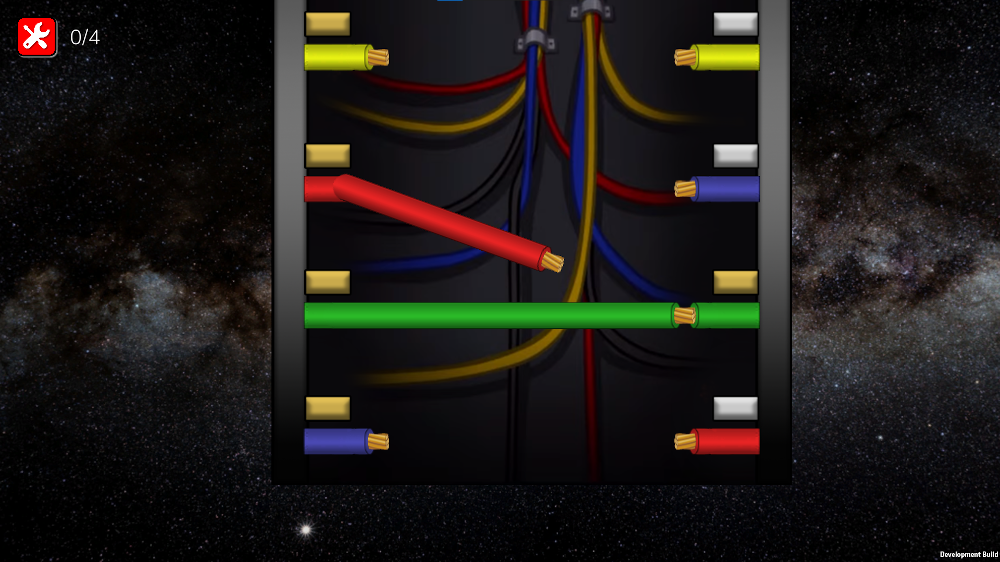
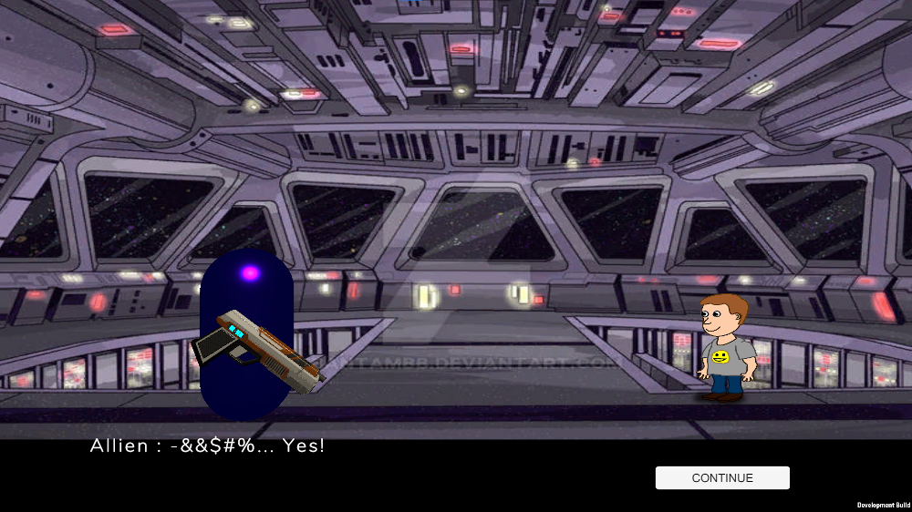

# GarbageSeekers-Game

A game project implemented for the needs of the Interactive Systems course in 2020-2021

## Game Goal

An environmental game that aims to raise awareness about the trash pollution and to show that **one man's trash is another man's treasure**.

## Game Concept

A group of aliens is forced to visit earth due to the lack of energy in the spaceship reactor. They land on an inhabited island. Their goal is to find a weird plastic resource, with which they will be able to produce the required energy that they need. Luckily, this valuable resource exists in the garbage of humans, AND IT IS EVERYWHERE. So, the collection starts.

However, the residents of the island, seeing aliens wondering around, they get scared and aggressive, so they hunt, and attack the aliens. In order to survive in this hostile environment, the aliens the have to freeze the humans, and continue their tasks.

When the collection is complete, the spaceship repairing starts. However, new problems will come up.

---

# Technical

The game is implemented with the Unity Engine, and more specifically with 2019 version. Also, for the multiplayer part the Photo engine is used. 

## Packages

Packages that should be imported in order to build the Game

- PUN2
- TextMeshPro (optional - imported by the UI)
- Free Island Collection
- Low Poly Buildings Lite
- nave (Spaceship)
- Simple Vehicle Pack
- SpazeZeta_PlasticTrashBins
- Trash Pack Low Poly
- Death_Artisan\Free Tees
- MASH Virtual (the collector gun)
- simple modular human
- LeanTween

---

# Doanload the Game

Wanna play the game? You can download it from [here](https://drive.google.com/file/d/1XkneH2OEOST_-KWWaVysgVBrGSdpDUWC/view?usp=sharing)

# Music Credits

- Menu song: [Sci-Fi Music — Deep Cosmos Beats — Futuristic Chillstep Mix](https://youtu.be/VslI_7VEhck)
- Garbage collection scene: [Chill Summer Video Game Music](https://www.youtube.com/watch?v=K03UnwKedvg&ab_channel=SuperMediaAllStars)

# Gallery

## Menu 

## Scene 1 - Garbage Collection

## Scene 2- Spaceship

## Scene 3- Dialog Scene

